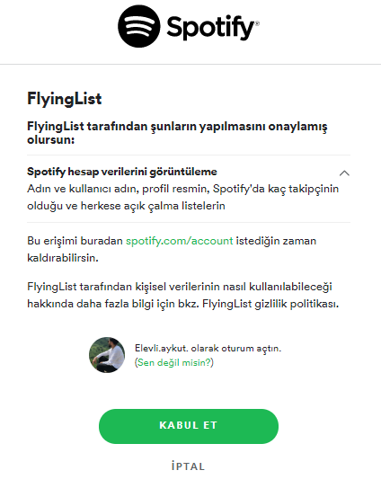
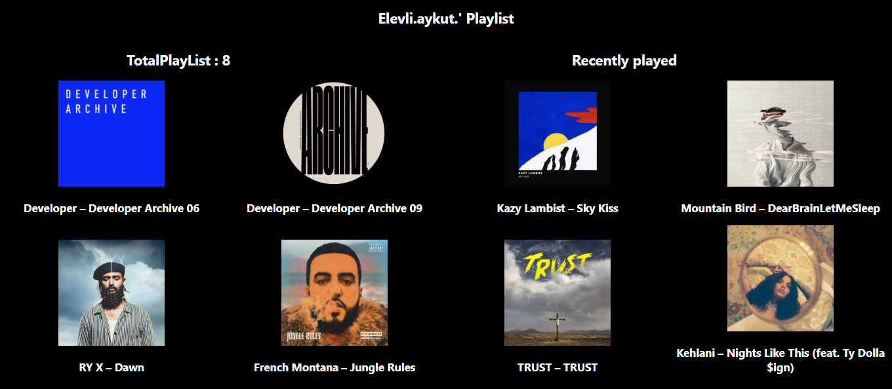

### FlyingList (FrontEnd Server) 🎉

I decided to make free time project using Spotify API to see the playlists of a user on Spotify.

✔️ React

✔️ Node.js with Express

✔️ Spotify OAuth for authentication.

🎉 You can see backend server via https://github.com/elevliaykut/Flylist

